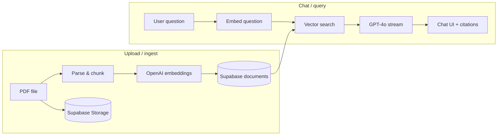

# DocuMind AI

**DocuMind AI** is a retrieval-augmented generation (RAG) web app that lets you chat with your own PDFs and with a shared company knowledge base. Upload documents, ask questions in natural language, and get answers grounded in your sources—with citations showing which file and page the answer came from.

Repository: [github.com/Prajitzala/DocuMindAI](https://github.com/Prajitzala/DocuMindAI)

---

## What it does

| Mode | Description |
|------|-------------|
| **My PDFs** | Upload PDF files, chunk and embed them, then chat only over your uploads. Each user sees only their own documents. |
| **Knowledge base** | Query pre-loaded company content in categories: HR, Legal, and Engineering. Available to all signed-in users. |
| **Admin panel** | Users with the `admin` role can manage knowledge-base documents via a protected admin UI and API. |

Answers are generated by **OpenAI GPT-4o** using retrieved context from **Supabase pgvector**, not from the model’s general training data alone.

---

## How it works (high level)



1. **Ingest** — A PDF is stored in Supabase Storage, parsed into text chunks, embedded with `text-embedding-3-small`, and saved in the `documents` table with a namespace and metadata (filename, page).
2. **Query** — The user’s question is embedded, the top matching chunks are retrieved via the `match_documents` RPC, and GPT-4o streams an answer constrained to that context.
3. **Citations** — The UI shows which PDF and page each answer drew from.

---

## Tech stack

| Layer | Technology |
|-------|------------|
| Framework | [Next.js](https://nextjs.org) 16 (App Router) |
| UI | React 19, Tailwind CSS 4, [shadcn/ui](https://ui.shadcn.com) |
| Auth & database | [Supabase](https://supabase.com) (Auth, Postgres, pgvector, Storage) |
| RAG | [LangChain.js](https://js.langchain.com) |
| LLM & embeddings | OpenAI (`gpt-4o`, `text-embedding-3-small`) |
| PDF parsing | `pdf-parse`, `pdfjs-dist`, `canvas` |

---

## Prerequisites

Before you start, you need:

- **Node.js** 18.18+ (20+ recommended)
- **npm** (or pnpm / yarn)
- A **[Supabase](https://supabase.com)** project (free tier is fine)
- An **[OpenAI API key](https://platform.openai.com/api-keys)** with access to chat and embeddings

---

## Quick start

### 1. Clone and install

```bash
git clone https://github.com/Prajitzala/DocuMindAI.git
cd DocuMindAI
npm install
```

### 2. Configure environment variables

Copy the example file and fill in your keys:

```bash
cp .env.local.example .env.local
```

Edit `.env.local`:

| Variable | Where to get it | Notes |
|----------|-----------------|-------|
| `NEXT_PUBLIC_SUPABASE_URL` | Supabase → **Settings** → **API** | Safe for the browser |
| `NEXT_PUBLIC_SUPABASE_ANON_KEY` | Same page (anon / public key) | Safe for the browser |
| `SUPABASE_SERVICE_KEY` | Same page (service role key) | **Server only** — never expose in client code |
| `OPENAI_API_KEY` | [OpenAI API keys](https://platform.openai.com/api-keys) | Used for embeddings and chat |

> **Never commit `.env.local`.** It is listed in `.gitignore`.

### 3. Set up Supabase

Run the SQL migrations in order in the Supabase **SQL Editor** (or via the Supabase CLI):

1. `supabase/migrations/001_create_documents.sql` — `documents` table, pgvector index, RLS, `match_documents` function  
2. `supabase/migrations/002_storage_pdfs.sql` — private `pdfs` storage bucket and policies  

**Auth (required for sign-in):**

- In Supabase → **Authentication** → **Providers**, enable the methods you want (e.g. Email, Google).
- Under **URL configuration**, set **Site URL** to `http://localhost:3000` for local dev.
- Add `http://localhost:3000/auth/callback` to **Redirect URLs**.

**Admin users:**

- In Supabase → **Authentication** → **Users**, open a user → **User metadata** and set:
  ```json
  { "role": "admin" }
  ```
- Only users with `role: "admin"` can access `/admin` and the admin API.

### 4. Run the app

```bash
npm run dev
```

Open [http://localhost:3000](http://localhost:3000).

- Sign up or sign in on the landing page.
- Go to **Dashboard** to upload PDFs or switch namespaces and chat.
- Admins can open **Admin** to manage knowledge-base content.

### 5. Production build (optional)

```bash
npm run build
npm start
```

---

## Project structure

```
documind-ai/
├── app/
│   ├── page.jsx                 # Landing (redirects to dashboard if logged in)
│   ├── dashboard/page.jsx       # Main chat + upload UI
│   ├── admin/page.jsx           # Admin KB management (admin role only)
│   ├── auth/callback/route.js   # Supabase OAuth / magic-link callback
│   └── api/
│       ├── upload/route.js      # PDF → chunk → embed → store
│       ├── chat/route.js        # RAG query → streamed GPT-4o reply
│       ├── documents/route.js   # List / delete user documents
│       └── admin/route.js       # Knowledge-base CRUD (server, admin only)
├── components/                  # UI: chat, upload, landing, shadcn primitives
├── lib/
│   ├── rag.js                   # Ingest + query pipeline
│   ├── pdf-parser.js            # PDF text extraction + splitting
│   ├── supabase.js              # Browser Supabase client
│   └── supabase-server.js       # Server client (cookies + service role)
├── supabase/migrations/         # Database + storage setup SQL
├── docs/                        # Architecture notes & roadmap
└── .env.local.example           # Environment variable template
```

---

## Document namespaces

Namespaces control **who can read** which embeddings. Do not rename these strings without updating the app and migrations.

| Namespace | Purpose | Who can read |
|-----------|---------|--------------|
| `user-upload` | PDFs uploaded by users | Owner only (RLS) |
| `kb-hr` | HR policies & docs | All authenticated users |
| `kb-legal` | Legal / contracts | All authenticated users |
| `kb-engineering` | Technical documentation | All authenticated users |

Knowledge-base rows (`kb-*`) are written only from **server-side** admin routes using the service role key.

---

## API overview

| Endpoint | Method | Description |
|----------|--------|-------------|
| `/api/upload` | POST | Upload PDF, ingest chunks into `user-upload` |
| `/api/chat` | POST | RAG chat; body includes `question` and `namespace` |
| `/api/documents` | GET / DELETE | List or remove the current user’s uploads |
| `/api/admin` | * | Admin-only knowledge-base operations |

All API routes expect an authenticated Supabase session unless noted otherwise in the route implementation.

---

## Security notes

- **Row Level Security (RLS)** on `documents` and Storage ensures users only access their own PDFs; KB namespaces are shared read-only for authenticated users.
- **`SUPABASE_SERVICE_KEY`** bypasses RLS — use it only in server API routes (`lib/supabase-server.js`), never in client components.
- **Admin routes** must not be called directly from untrusted clients without verifying the `admin` role on the server.
- Keep **OpenAI** and **Supabase service** keys out of version control and CI logs.

---

## Deployment

The app is designed to deploy on **[Vercel](https://vercel.com)** (or any Node host that supports Next.js):

1. Push this repo to GitHub.
2. Import the project in Vercel and connect the repository.
3. Add the same environment variables as in `.env.local`.
4. Update Supabase **Site URL** and **Redirect URLs** to your production domain (e.g. `https://your-app.vercel.app/auth/callback`).

**Note:** Vercel Hobby has a ~10s serverless timeout. Very large PDFs may need smaller files or a higher plan.

---

## Scripts

| Command | Description |
|---------|-------------|
| `npm run dev` | Start development server at `localhost:3000` |
| `npm run build` | Create a production build |
| `npm start` | Run the production server |
| `npm run lint` | Run ESLint |

---

## Troubleshooting

| Issue | What to check |
|-------|----------------|
| Vector search returns nothing | Migrations applied? `match_documents` exists? Embeddings column populated? |
| Upload fails on PDF | File under 10 MB? MIME type `application/pdf`? `canvas` / `pdfjs-dist` installed? |
| Auth redirect loop | Supabase redirect URLs include your exact origin + `/auth/callback` |
| Admin page “Access denied” | User metadata includes `"role": "admin"` |
| OpenAI errors | Valid API key, billing enabled, model access for `gpt-4o` and embeddings |

---

## Contributing

1. Fork the repository.
2. Create a feature branch (`git checkout -b feature/your-feature`).
3. Commit your changes and open a pull request.

For internal conventions and RAG details, see `CLAUDE.md` and `docs/`.

---

## License

This project is private by default (`package.json` sets `"private": true`). Add a `LICENSE` file if you intend to open-source it under a specific license.

---

## Author

Built by [Prajitzala](https://github.com/Prajitzala).
